<strong> Note: The development of the project has been suspended for an indefinite period. </strong>

# License Plate Reader
The main assumption of the project is to create an algorithm that return the plate characters in text form from the photo.

The project was written in Python, using the Keras and OpenCV library.  

## Issuses
- [ ] The car's photo database is currently too small and the model is not able to accurately indicate the location of the car registration.
- [ ] The algorithm does not always correctly divide the picture into individual characters.
- [ ] Sometimes the model incorrectly predicts characters.

## Car photo
The following license plate is modified and is fake :trollface:
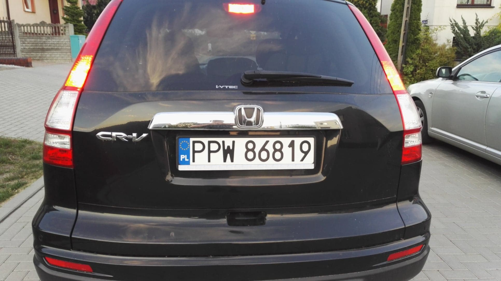

## Plate prediction (red points)
The first model calculates four points (corners) of the license plate from the photo
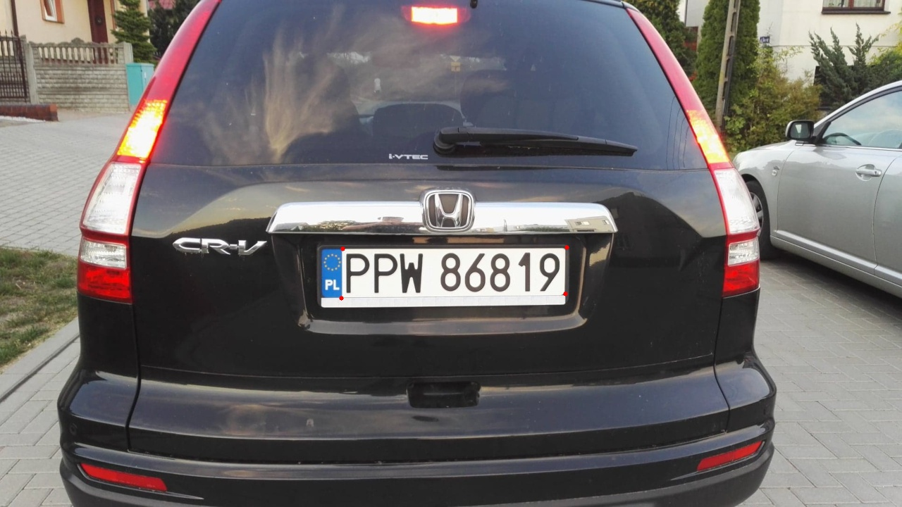

## Cut and transform plate
The algorithm performs the following steps:
- `Image ROI`
- `cv2.getPerspectiveTransform()`
- `cv2.warpPerspective()`

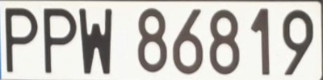

## Normalize plate
Subsequent actions are performed:
- `cv2.equalizeHist()`
- `cv2.threshold()`
- `cv2.erode()`
- `cv2.dilate()`
- `cv2.findContours()`

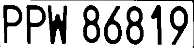

## Split chars
- contours are sorted relative to the x axis
- only the largest contours in the area are selected
- they are divided, and the distances between them are saved

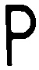
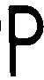
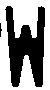

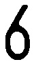
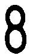
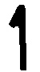
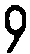

## Result of prediction 
Based on the characters, the second model predicts them and are returned in text form ['P', 'P', 'W', ' ', '8', '6', '8', '1', '9']

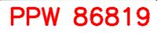
